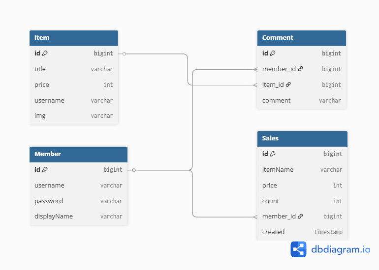

# 🛏️ CozyHouse

Spring Boot로 제작한 가구 쇼핑몰 CRUD 웹사이트

## 📑 Table of Contents

1. [소개](#소개)
2. [기술 스택](#기술-스택)
3. [주요 기능](#주요-기능)
4. [ERD](#ERD)
5. [화면 캡처](#화면-캡처)
6. [개발 후기](#개발-후기)

## 📝 소개

CozyHouse는 가구를 판매하는 쇼핑몰 웹사이트입니다.  
Spring Boot와 Thymeleaf를 이용해 백엔드와 프론트엔드를 통합 개발하였고,  
CRUD 기능과 검색 기능을 통해 실제 상품 관리 및 조회가 가능합니다.

- **개발 기간:** 2025.04 ~ 2025.05
- **개발 인원:** 개인 프로젝트

## ⚙️ 기술 스택

- **Backend:** Spring Boot, Spring MVC, Spring Security, JPA, MySQL
- **Frontend:** Thymeleaf, HTML, CSS, JavaScript
- **Build Tool:** Gradle
- **IDE:** IntelliJ IDEA
- **VCS:** Git, GitHub

## ✨ 주요 기능 및 구현 방식

- **회원가입**
  - Spring Security + BCryptPasswordEncoder로 비밀번호 암호화 후 저장
- **로그인/로그아웃**
  - Spring Security의 세션 기반 인증 적용, SecurityConfig로 커스터마이징
- **상품 등록/수정/삭제 (CRUD), 댓글, 주문기능**
  - Spring Data JPA의 JpaRepository 사용
  - Authtentication 객체를 이용하여 로그인 여부 판별
- **상품 이미지 업로드**
  - 이미지 파일을 S3에 업로드 후, S3 주소를 DB에 저장
- **상품 리스트 페이지네이션**
  - Spring Data JPA의 Pageable 메서드 활용
- **상품 검색**
  - Repository에 SQL쿼리로 제목을 조회하는 메서드 정의하여 구현

## 🗂 ERD

## 🖼️ 화면 캡처

### 🔷 메인 페이지

### 🔷 상품 등록 페이지

## 💡 개발 후기

- 처음으로 Spring Security를 적용하며 로그인/회원가입 기능을 구현했고, SecurityConfig의 흐름을 학습할 수 있었습니다.
- JPA를 활용해 CRUD 로직을 간결하게 작성할 수 있었고, 프론트엔드와 백엔드의 연동을 경험하며 웹 개발 전반의 흐름을 이해하게 되었습니다.
